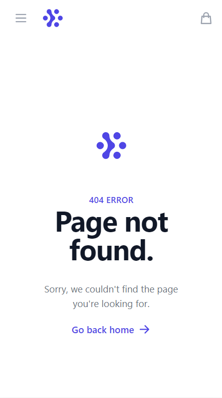

# eCommerceApp
## About Project

This repository contains an e-commerce app project developed with React. In this project, [Fake Store API](https://fakestoreapi.com/) was used as service, Context API was used for state management and Tailwind CSS was used for UI design. No authentication system was used.

- **Home:** Home page contains Categories Section and Top 10 Products Section. All categories are shown in Categories Section and first 10 products fetched from API are listed in Top 10 Products Section. 
- **Categories:** All categories are listed in categories section. Customer can view products by category when they click any category. 
- **Products:** All fetched products from API are listed in products section. Customer can view product detail when they click the product and add to cart by clicking "Add to basket" button.
- **Cart:** All products in the cart, shipping charge and total price are listed in cart page. According to this scenario, shipping charge is calculated as 10% of total price in orders under 100\$. Shipping is free of charge in orders over 100\$. 
Customer can increase/decrease quantity of products or remove any item or empty the cart by clicking "Empty the cart" button if they want. Order is created when "Checkout" button is clicked.
- **Orders:** Customer can display their all orders in orders section. Name, image and quantity of products can be viewed in orders.
## Screenshots
#### Desktop Screenshots

  

  

  

  

  

  

#### Mobile Screenshots

   

  

  

  

  

## Used Technologies

   

## Credits

**Özge Demiryol**

 

If you have any recommendation about project or noticed any error/bug, please give me feedback. 

